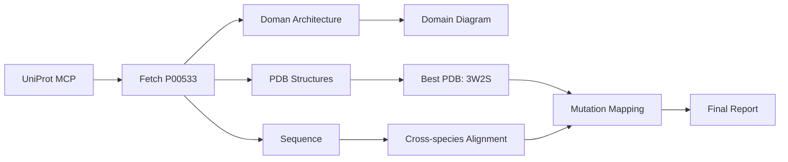

<div align="center">

  <h1>🧬 Claude Code for Biology Research</h1>
  <p>
    <strong>A comprehensive guide to using Claude Code as an AI-powered assistant for computational biology, bioinformatics, and biomedical research</strong>
  </p>
  <p>
    <a href="#-installation"></a>
    <a href="#-quick-start"></a>
    <a href="#-skills-for-biology"></a>
    <a href="#-mcp-servers"></a>
    <a href="#-biology-workflows"></a>
  </p>
  <p>
    <a href="README.zh-CN.md"></a>
    <a href="https://claude.ai/code"></a>
    <a href="https://modelcontextprotocol.io"></a>
    <a href="https://github.com/Jeny-Liu/claude-code-biology-research"></a>
  </p>
  <br/>
    <br/>
  
  <br/>
</div>

---

## 📋 Table of Contents

- [🌐 Overview](#-overview)
- [✨ Key Features](#-key-features)
- [📦 Installation](#-installation)
  - [System Requirements](#system-requirements)
  - [Installing Claude Code](#installing-claude-code)
  - [Authentication](#authentication)
  - [Proxy Configuration](#proxy-configuration)
  - [Verifying Installation](#verifying-installation)
- [🚀 Quick Start](#-quick-start)
  - [Your First Biology Session](#your-first-biology-session)
  - [Key CLI Commands](#key-cli-commands)
- [🧠 Skills for Biology Research](#-skills-for-biology-research)
  - [Built-in Skills](#built-in-skills)
  - [Custom Biology Skills](#custom-biology-skills)
  - [Skill Development Guide](#skill-development-guide)
- [🔌 MCP Servers](#-mcp-servers)
  - [What is MCP?](#what-is-mcp)
  - [Essential Biology MCP Servers](#essential-biology-mcp-servers)
  - [MCP Configuration Guide](#mcp-configuration-guide)
  - [Custom MCP Server Development](#custom-mcp-server-development)
- [🧪 Biology Workflows](#-biology-workflows)
  - [Genomics & Transcriptomics](#genomics--transcriptomics)
  - [Proteomics & Structural Biology](#proteomics--structural-biology)
  - [Literature Review & Meta-analysis](#literature-review--meta-analysis)
  - [Biological Image Analysis](#biological-image-analysis)
  - [Laboratory Protocol Design](#laboratory-protocol-design)
- [📝 Practical Examples](#-practical-examples)
  - [Example 1: RNA-seq Data Analysis](#example-1-rna-seq-data-analysis)
  - [Example 2: Protein Structure Retrieval](#example-2-protein-structure-retrieval)
  - [Example 3: Literature Review Automation](#example-3-literature-review-automation)
- [⚙️ Advanced Configuration](#️-advanced-configuration)
  - [Settings.json Deep Dive](#settingsjson-deep-dive)
  - [Custom Hooks](#custom-hooks)
  - [Environment Management](#environment-management)
- [🤝 Best Practices](#-best-practices)
- [📚 Resources & References](#-resources--references)
- [📄 License](#-license)

---

## 🌐 Overview

**Claude Code** is Anthropic's official command-line interface (CLI) for Claude, designed to be an **agentic AI coding assistant** that works directly in your terminal. For biology researchers and computational biologists, Claude Code represents a paradigm shift — it bridges the gap between biological domain knowledge and computational implementation.

Instead of switching between multiple tools, databases, and programming environments, you can:

1. **Describe your biology research task in natural language**
2. **Let Claude Code understand the context and generate appropriate code**
3. **Execute, debug, and refine analyses interactively**
4. **Automate repetitive bioinformatics workflows**
5. **Integrate with public biological databases and lab data systems**


### How It Works

Claude Code operates as an **agentic system** in your terminal:

```
You: "Download RNA-seq data from GEO accession GSE12345, perform differential expression analysis, and create a volcano plot"

Claude Code:
  ✓ Parses your request into actionable steps
  ✓ Uses MCP tools to query GEO database
  ✓ Downloads FASTQ/count data
  ✓ Writes Python/R script for DESeq2 analysis
  ✓ Executes the analysis
  ✓ Generates publication-quality figures
  ✓ Summarizes results
```

This guide covers everything from installation to advanced workflow orchestration for biology research.

---

## ✨ Key Features

| Feature | Biology Research Application |
|---------|---------------------------|
| **🧬 Natural Language to Code** | Describe biology concepts; Claude writes Python/R/Bash scripts |
| **🔗 MCP Tool Integration** | Direct access to NCBI, UniProt, PDB, PubMed, and more |
| **📊 Multi-modal Support** | Analyze microscope images, gel photos, and plots |
| **🔄 Autonomous Workflows** | End-to-end analysis pipelines with iterative refinement |
| **📝 Academic Writing** | Draft manuscripts, methods sections, and literature reviews |
| **📦 Reproducible Science** | Generate Conda/Docker environments, package requirements |
| **🗂️ Project Management** | Organize code, data, and results in structured projects |
| **🤝 Collaborative** | Git-native, team-friendly, shareable analysis scripts |

---

## 📦 Installation

### System Requirements

| Requirement | Minimum | Recommended |
|------------|---------|-------------|
| **OS** | macOS 10.15+, Ubuntu 20.04+, Windows 10+ (via WSL2) | Latest stable |
| **Node.js** | 18.x | 20.x LTS |
| **npm** | 8.x | 10.x+ |
| **Python** | 3.8 | 3.11+ (for bioinformatics) |
| **R** | 4.0 | 4.3+ (for Bioconductor) |
| **Disk Space** | 1 GB | 10 GB+ (for biological databases) |
| **RAM** | 4 GB | 16 GB+ |
| **Internet** | Required for installation and API access | Broadband |

### Installing Claude Code

#### Method 1: npm (Recommended)

```bash
# Install globally
npm install -g @anthropic-ai/claude-code

# Or use npx for one-off usage
npx @anthropic-ai/claude-code
```

#### Method 2: VS Code Extension

Install the [Claude Code Extension](https://marketplace.visualstudio.com/items?itemName=anthropic.claude-code) from the VS Code Marketplace, or:

```bash
# Install via VS Code CLI
code --install-extension anthropic.claude-code
```

#### Method 3: Homebrew (macOS/Linux)

```bash
brew install anthropic/claude-code/claude-code
```

#### Method 4: Direct Download

Download the latest release from [Claude Code Releases](https://github.com/anthropics/claude-code/releases).

### Authentication

Claude Code requires an Anthropic API key:

```bash
# Set your API key
export ANTHROPIC_API_KEY="sk-ant-xxxxxxxxxxxx"

# Or save it to ~/.claude/.env for persistence
echo 'ANTHROPIC_API_KEY="sk-ant-xxxxxxxxxxxx"' >> ~/.claude/.env
```

> 💡 **For biology researchers:** If your institution has an enterprise Anthropic account, request an API key through your institutional IT department. Consider security and data privacy — do not share your API key.

#### Getting Your API Key

1. Visit [console.anthropic.com](https://console.anthropic.com)
2. Create an account or sign in
3. Navigate to **API Keys**
4. Create a new key
5. Copy the key and store it securely

### Proxy Configuration

If your institution uses a proxy (common in research environments):

```bash
# HTTP/HTTPS proxy
export HTTP_PROXY="http://proxy.your-institution.edu:8080"
export HTTPS_PROXY="http://proxy.your-institution.edu:8080"

# Configure git proxy (for cloning repos)
git config --global http.proxy http://proxy.your-institution.edu:8080
git config --global https.proxy http://proxy.your-institution.edu:8080

# Configure npm proxy
npm config set proxy http://proxy.your-institution.edu:8080
npm config set https-proxy http://proxy.your-institution.edu:8080
```

### Verifying Installation

```bash
# Check version
claude --version

# Start an interactive session
claude

# Run a quick test
claude -p "Write a Python script that prints the reverse complement of a DNA sequence: ATGCGTAC"
```

**Expected output:**
```python
def reverse_complement(seq):
    """Return the reverse complement of a DNA sequence."""
    complement = {'A': 'T', 'T': 'A', 'C': 'G', 'G': 'C'}
    return ''.join(complement.get(base, base) for base in reversed(seq))

seq = "ATGCGTAC"
result = reverse_complement(seq)
print(f"Original: {seq}")
print(f"Reverse complement: {result}")
# Output: Original: ATGCGTAC
#         Reverse complement: GTACGCAT
```

---

## 🚀 Quick Start

### Your First Biology Session

```bash
# Start Claude Code
claude
```

Once inside the interactive session, try these biology research prompts:

```
1️⃣ "Download the human genome assembly hg38 FASTA file using curl and index it with samtools"

2️⃣ "Write a Python script using BioPython to parse a GenBank file and extract CDS features.
     Save it as parse_genbank.py"

3️⃣ "Search PubMed for recent papers on CRISPR prime editing and summarize the top 5"

4️⃣ "Create a volcano plot from this differential expression CSV file using ggplot2 in R"
```

### Key CLI Commands

| Command | Purpose | Biology Research Use |
|---------|---------|---------------------|
| `claude` | Start interactive session | Begin a research analysis session |
| `claude -p "prompt"` | Run one-off command | Quick sequence manipulation |
| `claude --model "claude-sonnet-4-20250514"` | Specify model | Use latest model for complex analyses |
| `claude -e "python script.py" "` | Edit existing file | Refine an analysis script |
| `claude -i "path/to/file"` | Include system prompt | Load institutional protocols |
| `/clear` | Clear session | Reset for new analysis |
| `/help` | Show help | Browse available commands |
| `/init` | Init project config | Set up project-specific settings |
| `/fast` | Toggle fast mode | Quick responses for simple tasks |
| `/loop` | Repeat command periodically | Monitor long-running analyses |

> 💡 **Pro tip:** Use `claude -p "prompt"` in shell scripts to build automated bioinformatics pipelines!

---

## 🧠 Skills for Biology Research

Claude Code's **Skills** are specialized capabilities — think of them as plugins that give Claude expert-level abilities in specific domains. Skills can be loaded via `/skill-name` in CLI or invoked programmatically.

### Built-in Skills

Here are the most valuable built-in skills for biology research:

#### 📚 Literature & Writing Skills

| Skill | Invocation | Description | Biology Use Case |
|-------|-----------|-------------|-----------------|
| **systematic-literature-review** | `/systematic-literature-review` | Multi-source literature search, quality scoring, and auto-generation of structured reviews | Systematic reviews, meta-analyses, related work sections |
| **academic-writing-polisher** | `/academic-writing-polisher` | Polish academic writing with domain-aware style corrections | Manuscript refinement, grant proposals |
| **paper-write-sci** | `/paper-write-sci` | Generate scientific paper drafts from data and outlines | Full manuscript drafting |
| **paper-select-journal** | `/paper-select-journal` | Recommend target journals based on manuscript content | Journal selection guidance |
| **review-papers** | `/review-papers` | Peer review simulation with structured feedback | Pre-submission review |
| **paper-explain-figures** | `/paper-explain-figures` | Interpret scientific figures and create accessible descriptions | Figure legends, accessibility |

#### 🔬 Bioinformatics & Lab Skills

| Skill | Invocation | Description |
|-------|-----------|-------------|
| **chem-vis** | `/chem-vis` | Generate 2D/3D molecular visualizations from SMILES/names |
| **thesis-review** | `/thesis-review` | Comprehensive thesis structure and content review |
| **systematic-literature-review** | `/systematic-literature-review` | AI-powered literature survey with quality scoring |

#### 🛠️ Development & Workflow Skills

| Skill | Invocation | Description |
|-------|-----------|-------------|
| **code-review** | `/code-review` | Review bioinformatics code for correctness and efficiency |
| **simplify** | `/simplify` | Optimize and refactor analysis scripts |
| **verify** | `/verify` | Verify that code changes work as expected |
| **deep-research** | `/deep-research` | Multi-source deep research with fact-checking and citations |
| **init** | `/init` | Project scaffolding |
| **run** | `/run` | Launch and interact with project applications |

### Custom Biology Skills

You can create custom skills for your specific biology research needs:

```bash
# Create a new skill
claude -p "Create a custom skill for single-cell RNA-seq analysis workflow automation"
```

Example custom skill structure for a **single-cell RNA-seq analysis skill**:

<details>
<summary>📁 <strong>Custom Skill Example: scRNA-seq Analysis Skill</strong> (Click to expand)</summary>

```markdown
# Skill: scrna-seq-analysis

## Description
Automated single-cell RNA-seq analysis pipeline using ScanPy and Seurat

## Triggers
- "analyze single cell data"
- "scRNA-seq workflow"
- "single cell clustering"

## Steps
1. Quality control: Filter cells based on gene counts and mitochondrial content
2. Normalization: Log-normalize and identify highly variable genes
3. Dimensionality reduction: PCA, UMAP, t-SNE
4. Clustering: Leiden clustering with resolution optimization
5. Marker identification: Differential expression per cluster
6. Cell type annotation: Automated annotation using reference databases
7. Visualization: UMAP plots, heatmaps, dotplots

## Dependencies
- scanpy>=1.9
- anndata>=0.9
- leidenalg
- matplotlib>=3.6
- pandas>=1.5
```
</details>

### Skill Development Guide

To create biology-focused skills:

```bash
# Step 1: Use the skill-creator
# In Claude Code:
/skill-creator

# Step 2: Describe your biology workflow
# "Create a skill for ChIP-seq peak calling and motif analysis"

# Step 3: The skill will be registered and available via /your-skill-name
```

**Skill Design Principles for Biology:**

| Principle | Description | Example |
|-----------|-------------|---------|
| **Domain-specific** | Focus on one biological analysis type | "ChIP-seq analysis" not "sequencing analysis" |
| **Reproducible** | Include version-locked dependencies | `scanpy==1.9.3` |
| **Documented** | Clear input/output specifications | Input: FASTQ files, Output: peak BED files |
| **Modular** | Composable with other skills | QC skill → Alignment skill → Peak calling skill |

---

## 🔌 MCP Servers

### What is MCP?

**MCP (Model Context Protocol)** is an open standard that allows Claude Code to connect directly with external tools, databases, and services. Think of MCP servers as **"adapters"** that give Claude real-time access to biological data sources and computational tools.


**How MCP works with Claude Code:**

```
┌─────────────┐    MCP Protocol    ┌──────────────┐    HTTP/API    ┌──────────────┐
│  Claude Code │ ◄──────────────► │  MCP Server  │ ◄────────────► │  NCBI / UniProt / PDB / PubMed  │
│  (AI Engine) │                  │  (Adapter)   │               │  (Databases)  │
└─────────────┘                  └──────────────┘               └──────────────┘
```

### Essential Biology MCP Servers

#### 1️⃣ **NCBI/BLAST MCP Server**

Access National Center for Biotechnology Information databases and BLAST search:

```json
{
  "mcpServers": {
    "ncbi-biology": {
      "command": "uvx",
      "args": ["ncbi-mcp-server"],
      "env": {
        "NCBI_API_KEY": "your_ncbi_api_key",
        "EMAIL": "your.email@institution.edu"
      }
    }
  }
}
```

**Capabilities:**
- `search_nucleotide(query)` — Search nucleotide databases
- `search_protein(query)` — Search protein databases  
- `run_blast(sequence, database)` — BLAST sequence search
- `fetch_genbank(accession)` — Download GenBank records
- `fetch_fasta(accession)` — Download FASTA sequences
- `search_pubmed(query)` — PubMed literature search
- `search_geo(query)` — GEO dataset search

> 🔑 **NCBI API Key:** Register at [ncbi.nlm.nih.gov](https://www.ncbi.nlm.nih.gov/account/) for higher rate limits. Without a key, you're limited to 3 requests/second; with a key, 10 requests/second.

#### 2️⃣ **UniProt/PDB MCP Server**

Access protein sequence, structure, and functional data:

```json
{
  "mcpServers": {
    "uniprot-pdb": {
      "command": "uvx",
      "args": ["uniprot-mcp-server"]
    }
  }
}
```

**Capabilities:**
- `search_uniprot(query)` — Search UniProtKB
- `get_protein(accession)` — Retrieve protein entry
- `fetch_pdb(pdb_id)` — Download PDB structure files
- `search_pdb(query)` — Search PDB for structures
- `get_alphafold(uniprot_id)` — Retrieve AlphaFold predictions
- `get_protein_features(accession)` — Domain, site, and feature annotations
- `search_by_sequence(sequence)` — Sequence similarity search

#### 3️⃣ **PubMed MCP Server**

Advanced literature mining and retrieval:

```json
{
  "mcpServers": {
    "pubmed-mcp": {
      "command": "npx",
      "args": ["-y", "pubmed-mcp-server"],
      "env": {
        "NCBI_API_KEY": "your_ncbi_api_key"
      }
    }
  }
}
```

**Capabilities:**
- `search_pubmed(query, max_results)` — Search with MeSH terms
- `fetch_article(pmid)` — Get full article metadata
- `fetch_pmc(pmcid)` — Get PMC full text
- `get_citations(pmid)` — Citation analysis
- `find_related(pmid)` — Find similar articles
- `search_with_filters(author, journal, year)` — Advanced filtering

#### 4️⃣ **BioPython MCP Server**

Execute BioPython operations for sequence manipulation:

```json
{
  "mcpServers": {
    "biopython-mcp": {
      "command": "uvx",
      "args": ["biopython-mcp-server"],
      "env": {
        "PYTHONPATH": "/path/to/python/lib"
      }
    }
  }
}
```

**Capabilities:**
- `parse_sequence(file, format)` — Parse FASTA/GenBank/FASTQ
- `translate_dna(sequence)` — DNA to protein translation
- `reverse_complement(sequence)` — Reverse complement
- `align_sequences(*sequences)` — Multiple sequence alignment
- `calculate_gc_content(sequence)` — GC content calculation
- `phylogenetic_tree(alignment)` — Tree construction
- `blast_sequence(sequence)` — Local or remote BLAST

#### 5️⃣ **R/Bioconductor MCP Server**

Statistical analysis for omics data:

```json
{
  "mcpServers": {
    "r-bioconductor": {
      "command": "uvx",
      "args": ["r-bioc-mcp-server"],
      "env": {
        "R_HOME": "/path/to/R",
        "BIOC_MIRROR": "https://bioconductor.org"
      }
    }
  }
}
```

**Capabilities:**
- `run_deseq2(counts, coldata, design)` — Differential expression
- `run_limma(expression, design)` — Microarray/RNA-seq analysis
- `run_enrichment(genelist, ontology)` — GO/KEGG enrichment
- `run_clustering(data, method)` — Hierarchical clustering
- `plot_volcano(results, pval, fc)` — Volcano plot generation
- `plot_heatmap(data, annotation)` — Heatmap visualization
- `run_pca(data, groups)` — Principal Component Analysis

#### 6️⃣ **GEO/SRA MCP Server**

Gene Expression Omnibus and Sequence Read Archive access:

```json
{
  "mcpServers": {
    "geo-sra": {
      "command": "uvx",
      "args": ["geo-mcp-server"],
      "env": {
        "NCBI_API_KEY": "your_ncbi_api_key"
      }
    }
  }
}
```

**Capabilities:**
- `search_geo(query)` — Find GEO datasets
- `fetch_geo_series(gse_id)` — Get series metadata
- `fetch_geo_platform(gpl_id)` — Platform information
- `get_sra_runs(accession)` — SRA run accessions
- `download_metadata(gse_id)` — Sample metadata table
- `search_datasets(keyword, organism)` — Filtered dataset search

#### 7️⃣ **Cheminformatics MCP Server**

Molecular analysis and drug discovery:

```json
{
  "mcpServers": {
    "cheminfo": {
      "command": "uvx",
      "args": ["cheminformatics-mcp-server"]
    }
  }
}
```

**Capabilities:**
- `smiles_to_structure(smiles)` — Generate molecular structure
- `calculate_properties(smiles)` — LogP, MW, HBA, HBD
- `search_pubchem(query)` — PubChem compound search
- `search_chembl(target)` — ChEMBL bioactivity data
- `dock_molecule(receptor, ligand)` — Molecular docking
- `fingerprint_similarity(smiles1, smiles2)` — Tanimoto similarity

#### 8️⃣ **Lab Data MCP Server**

Connect to Electronic Lab Notebooks (ELN) and Laboratory Information Management Systems (LIMS):

```json
{
  "mcpServers": {
    "lab-data": {
      "command": "python",
      "args": ["-m", "lab-data-mcp-server"],
      "env": {
        "LAB_API_URL": "https://your-lims.institution.edu/api",
        "LAB_API_TOKEN": "your_api_token"
      }
    }
  }
}
```

**Capabilities:**
- `query_experiments(filters)` — Search experiments
- `upload_data(experiment_id, file)` — Upload results
- `get_samples(project_id)` — List samples
- `update_protocol(protocol_id, content)` — Edit protocols
- `export_results(experiment_id, format)` — Data export

### MCP Configuration Guide

#### Global Configuration (applies to all projects)

```bash
# Edit the global settings file
nano ~/.claude/settings.json
```

```json
{
  "mcpServers": {
    "ncbi-biology": {
      "command": "uvx",
      "args": ["ncbi-mcp-server"],
      "env": {
        "NCBI_API_KEY": "${NCBI_API_KEY}",
        "EMAIL": "${EMAIL}"
      }
    },
    "pubmed-mcp": {
      "command": "npx",
      "args": ["-y", "pubmed-mcp-server"],
      "env": {
        "NCBI_API_KEY": "${NCBI_API_KEY}"
      }
    },
    "biopython-mcp": {
      "command": "uvx",
      "args": ["biopython-mcp-server"]
    },
    "uniprot-pdb": {
      "command": "uvx",
      "args": ["uniprot-mcp-server"]
    }
  }
}
```

#### Project-Specific Configuration

```bash
# In your biology project directory
cd /path/to/your/biology-project

# Create project settings
nano .claude/settings.json
```

```json
{
  "mcpServers": {
    "r-bioconductor": {
      "command": "uvx",
      "args": ["r-bioc-mcp-server"]
    },
    "geo-sra": {
      "command": "uvx",
      "args": ["geo-mcp-server"],
      "env": {
        "NCBI_API_KEY": "${NCBI_API_KEY}"
      }
    },
    "custom-lab-mcp": {
      "command": "python",
      "args": ["path/to/your/custom-mcp-server.py"]
    }
  }
}
```

#### Installing MCP Servers

Most MCP servers are installed automatically when first used. For manual installation:

```bash
# Using uvx (recommended for Python-based servers)
pip install uvx  # if not already installed
uvx ncbi-mcp-server

# Using npx (for Node.js-based servers)
npx -y pubmed-mcp-server

# Using pip
pip install ncbi-mcp-server

# Using conda (common in biology environments)
conda install -c bioconda ncbi-mcp-server
```

> 💡 **uvx** is the recommended way to run Python-based MCP servers — it auto-creates isolated environments.

### Custom MCP Server Development

You can build custom MCP servers to connect Claude Code with your lab's specific tools and databases.

#### Python MCP Server Template for Biology

**File: `my-biology-mcp-server.py`**

```python
#!/usr/bin/env python3
"""
Custom MCP Server for Biology Research
Connects Claude Code to your lab's specific databases and tools
"""

import json
import sys
from typing import Any
import requests

class BiologyMCPTool:
    """Base class for biology MCP tools"""
    
    def __init__(self, name: str, description: str, parameters: dict):
        self.name = name
        self.description = description
        self.parameters = parameters
    
    def execute(self, **kwargs) -> str:
        raise NotImplementedError

class SequenceAnalysis(BiologyMCPTool):
    """Tool for basic sequence analysis"""
    
    def __init__(self):
        super().__init__(
            name="analyze_sequence",
            description="Analyze a DNA/RNA/protein sequence",
            parameters={
                "type": "object",
                "properties": {
                    "sequence": {
                        "type": "string",
                        "description": "The biological sequence to analyze"
                    },
                    "seq_type": {
                        "type": "string",
                        "enum": ["dna", "rna", "protein"],
                        "description": "Type of sequence"
                    }
                },
                "required": ["sequence", "seq_type"]
            }
        )
    
    def execute(self, sequence: str, seq_type: str = "dna") -> str:
        """Perform sequence analysis"""
        seq = sequence.upper()
        length = len(seq)
        
        result = {
            "length": length,
            "molecular_weight": self._calc_mw(seq, seq_type),
            "gc_content": None
        }
        
        if seq_type in ("dna", "rna"):
            gc = (seq.count("G") + seq.count("C")) / length * 100
            result["gc_content"] = round(gc, 2)
            result["reverse_complement"] = self._revcomp(seq)
            
            if seq_type == "dna":
                result["is_coding"] = seq.startswith("ATG") and any(
                    seq[i:i+3] in STOP_CODONS for i in range(0, length, 3)
                )
        
        return json.dumps(result, indent=2)
    
    def _revcomp(self, seq: str) -> str:
        comp = {"A": "T", "T": "A", "C": "G", "G": "C", 
                "U": "A", "N": "N"}
        return "".join(comp.get(b, "N") for b in reversed(seq))
    
    def _calc_mw(self, seq: str, seq_type: str) -> float:
        # Simplified molecular weight calculation
        weights = {
            "dna": {"A": 313.2, "T": 304.2, "C": 289.2, "G": 329.2},
            "rna": {"A": 329.2, "U": 306.2, "C": 305.2, "G": 345.2},
            "protein": {"A": 89.1, "R": 174.2, "N": 132.1, "D": 133.1, "C": 121.2,
                       "Q": 146.2, "E": 147.1, "G": 75.1, "H": 155.2, "I": 131.2,
                       "L": 131.2, "K": 146.2, "M": 149.2, "F": 165.2, "P": 115.1,
                       "S": 105.1, "T": 119.1, "W": 204.2, "Y": 181.2, "V": 117.1}
        }
        return round(sum(weights.get(seq_type, weights["protein"]).get(b, 0) for b in seq), 2)


# MCP Protocol Implementation
class MCPToolRegistration:
    """Register and serve MCP tools"""
    
    def __init__(self):
        self.tools = {}
    
    def register(self, tool: BiologyMCPTool):
        self.tools[tool.name] = tool
    
    def list_tools(self) -> list:
        return [
            {
                "name": t.name,
                "description": t.description,
                "inputSchema": t.parameters
            }
            for t in self.tools.values()
        ]
    
    def call_tool(self, name: str, arguments: dict) -> Any:
        if name not in self.tools:
            return {"error": f"Unknown tool: {name}"}
        return self.tools[name].execute(**arguments)


# Main MCP server loop
def main():
    import subprocess
    import shlex
    
    server = MCPToolRegistration()
    server.register(SequenceAnalysis())
    
    print("Biology MCP Server initialized", file=sys.stderr)
    
    while True:
        try:
            line = sys.stdin.readline()
            if not line:
                break
            
            message = json.loads(line)
            
            if message["type"] == "list_tools":
                response = {
                    "type": "tool_list",
                    "tools": server.list_tools()
                }
            elif message["type"] == "call_tool":
                result = server.call_tool(
                    message["name"], 
                    message.get("arguments", {})
                )
                response = {
                    "type": "tool_result",
                    "result": result
                }
            
            print(json.dumps(response), flush=True)
            
        except json.JSONDecodeError:
            continue
        except Exception as e:
            print(json.dumps({"type": "error", "error": str(e)}), flush=True)

if __name__ == "__main__":
    main()
```

**Register your custom MCP server:**

```json
{
  "mcpServers": {
    "my-biology-lab": {
      "command": "python",
      "args": ["/path/to/my-biology-mcp-server.py"]
    }
  }
}
```

---

## 🧪 Biology Workflows

### Genomics & Transcriptomics

#### RNA-seq Differential Expression

```
In Claude Code:
"Download RNA-seq count data from GEO accession GSE123456.
 Perform differential expression analysis using DESeq2.
 The experimental design has 3 control and 3 treatment samples.
 Generate a volcano plot, heatmap of top 20 DEGs, and GO enrichment analysis."
```

<details>
<summary><strong>🔍 Expected workflow steps</strong> (Click to expand)</summary>

1. **Data retrieval**: Query GEO via MCP server → download count matrix
2. **Data preprocessing**: Filter low-count genes, normalize
3. **Statistical analysis**: DESeq2 differential expression (|log2FC| > 1, padj < 0.05)
4. **Visualization**: 
   - Volcano plot (ggplot2)
   - Heatmap of top 20 DEGs (pheatmap)
   - PCA plot
5. **Functional enrichment**: GO and KEGG pathway analysis (clusterProfiler)
6. **Report generation**: Summary statistics and figures

</details>

#### Variant Calling Pipeline

```
"Create a complete variant calling pipeline using GATK best practices.
 Process this BAM file: aligned_sample.bam.
 Include base quality recalibration, variant calling, and VCF filtering."
```

#### Single-cell RNA-seq Analysis

```
"Analyze this 10X Genomics scRNA-seq data.
 Perform QC filtering, normalization, clustering, and cell type annotation.
 Use Seurat (R) or ScanPy (Python)."
```

### Proteomics & Structural Biology

#### Protein Structure Retrieval and Analysis

```
"Fetch the protein structure for human TP53 (P04637) from PDB and UniProt.
 Visualize the DNA-binding domain and identify all missense mutations 
 that are associated with cancer."
```

<details>
<summary><strong>🔍 Expected workflow steps</strong> (Click to expand)</summary>

1. **Retrieve data**: UniProt entry P04637 via MCP server
2. **Fetch structure**: Best PDB structure(s) for TP53
3. **Domain analysis**: Identify functional domains (transactivation, DNA-binding, tetramerization)
4. **Mutation mapping**: Cross-reference with COSMIC/ClinVar for cancer-associated mutations
5. **Structure visualization**: Generate PyMOL/3D visualization script

</details>

#### Molecular Docking Workflow

```
"Perform molecular docking of compound CID_123456 against 
 the SARS-CoV-2 main protease (PDB: 6LU7).
 Use AutoDock Vina and visualize the binding pose."
```

### Literature Review & Meta-analysis

#### Systematic Literature Review

```bash
# Activate the systematic review skill
/systematic-literature-review

# The skill will guide you through:
# 1. Define research question with PICO framework
# 2. Multi-database search (PubMed, PMC, bioRxiv)
# 3. Automated paper screening and quality scoring
# 4. Data extraction and synthesis
# 5. Generate structured review with PRISMA diagram
```

#### Automated Paper Summarization

```
"Search PubMed for papers published in 2024-2025 on 'spatial transcriptomics'.
 Summarize each paper in 3 sentences.
 Create a table comparing methods, tissues studied, and key findings."
```

#### Citation Network Analysis

```
"Find all papers that cite the 2016 'Comprehensive genomic characterization 
 of head and neck squamous cell carcinomas' paper (PMID: 26940866).
 Categorize them by cancer type and analyze citation trends."
```

### Biological Image Analysis

#### Microscopy Image Processing

```
"Analyze these immunofluorescence images in the 'images/' directory.
 Quantify colocalization of DAPI and GFP signals.
 Generate a histogram of fluorescence intensities."
```

#### Western Blot Quantification

```
"Quantify the protein bands in this western blot image (gel.jpg).
 Normalize to the loading control (GAPDH).
 Calculate relative expression for each treatment condition."
```

### Laboratory Protocol Design

#### Protocol Generation

```
"Design a CRISPR-Cas9 knockout protocol for the TP53 gene in HEK293T cells.
 Include guide RNA design, plasmid construction, transfection, 
 and validation by Sanger sequencing. Provide primer sequences."
```

#### Protocol Optimization

```
"Optimize this qPCR protocol to improve amplification efficiency.
 Current protocol: [paste protocol here]
 Suggest annealing temperature gradient and primer redesign if needed."
```

---

## 📝 Practical Examples

### Example 1: RNA-seq Data Analysis

**Goal**: Complete RNA-seq analysis from GEO data to publication-ready figures.

**Prompt for Claude Code:**

```
I have an RNA-seq dataset from GEO (GSE123456) studying 
the effect of a drug treatment on breast cancer cells. 
There are 3 control and 3 treated samples.

Please:
1. Download the count data from GEO
2. Perform differential expression analysis using DESeq2
3. Create a volcano plot (log2FC vs -log10 p-value)
4. Generate a heatmap of the top 30 DEGs
5. Run GO enrichment analysis on upregulated genes
6. Save all results and figures to a 'results/' directory
```

**What Claude Code will do:**

```bash
# Step 1: Setup project structure
mkdir -p results figures data

# Step 2: Download data via MCP
# Claude queries GEO MCP server
# Downloads count matrix and metadata

# Step 3: Write and execute R script
Rscript deseq2_analysis.R

# Step 4: Generate figures
# Volcano plot → figures/volcano.pdf
# Heatmap → figures/heatmap.pdf
# PCA → figures/pca.pdf

# Step 5: Run enrichment
Rscript enrichment.R
# → results/go_enrichment.csv

# Step 6: Summarize results
cat results/summary.md
```

### Example 2: Protein Structure Retrieval

**Goal**: Retrieve and analyze protein structure information.

**Prompt for Claude Code:**

```
Using the UniProt MCP server, fetch information about human 
epidermal growth factor receptor (EGFR, P00533). 

Then:
1. Get the domain architecture
2. Find known PDB structures covering different domains
3. Retrieve the highest resolution structure (PDB: 3W2S for example)
4. Identify all tyrosine kinase domain mutations in cancer (from COSMIC)
5. Generate a schematic diagram showing the protein domains and mutation hotspots
6. Create a sequence alignment between human and mouse EGFR
```

**What Claude Code will do:**



### Example 3: Literature Review Automation

**Goal**: Automate a focused literature review on a specific topic.

**Prompt for Claude Code:**

```
Perform a systematic literature review on:
"Machine learning approaches for drug repurposing in rare diseases"

Use the systematic-literature-review skill to:
1. Search PubMed, bioRxiv, and CrossRef for relevant papers
2. Screen titles/abstracts for relevance (score 1-10)
3. Extract: year, journal, ML method, disease focus, data sources, performance metrics
4. Create a PRISMA flow diagram of the screening process
5. Generate a structured review with:
   - Summary of ML techniques used (graph neural networks, transformers, etc.)
   - Comparison of data sources (DrugBank, ChEMBL, ClinicalTrials.gov)
   - Key findings and validation methods
   - Future directions and limitations
6. Output as a formatted markdown document with references
```

---

## ⚙️ Advanced Configuration

### Settings.json Deep Dive

The `settings.json` file controls Claude Code's behavior. Location:

| Scope | File Path |
|-------|-----------|
| **Global** | `~/.claude/settings.json` |
| **Project** | `.claude/settings.json` (in project root) |

**Complete biology researcher's `settings.json`:**

```json
{
  "mcpServers": {
    "ncbi-biology": {
      "command": "uvx",
      "args": ["ncbi-mcp-server"],
      "env": {
        "NCBI_API_KEY": "${NCBI_API_KEY}",
        "EMAIL": "${EMAIL}"
      }
    },
    "pubmed-mcp": {
      "command": "npx",
      "args": ["-y", "pubmed-mcp-server"],
      "env": {
        "NCBI_API_KEY": "${NCBI_API_KEY}"
      }
    },
    "uniprot-pdb": {
      "command": "uvx",
      "args": ["uniprot-mcp-server"]
    },
    "biopython-mcp": {
      "command": "uvx",
      "args": ["biopython-mcp-server"]
    },
    "r-bioconductor": {
      "command": "uvx",
      "args": ["r-bioc-mcp-server"]
    },
    "geo-sra": {
      "command": "uvx",
      "args": ["geo-mcp-server"],
      "env": {
        "NCBI_API_KEY": "${NCBI_API_KEY}"
      }
    },
    "cheminfo": {
      "command": "uvx",
      "args": ["cheminformatics-mcp-server"]
    }
  },
  "permissions": {
    "allow": [
      "bash",
      "read",
      "write",
      "edit",
      "glob",
      "grep"
    ]
  }
}
```

### Custom Hooks

Hooks allow you to automate actions before/after Claude Code operations:

**File: `.claude/hooks/before-command.sh`**
```bash
#!/bin/bash
# Activate conda environment before each analysis
source ~/miniconda3/etc/profile.d/conda.sh
conda activate biology-env
```

**File: `.claude/hooks/after-command.sh`**
```bash
#!/bin/bash
# Log all commands to a timestamped file
echo "[$(date)] $CLAUDE_COMMAND" >> ~/.claude/history.log
```

### Environment Management

#### Conda Environment for Biology Research

```bash
# Create a comprehensive biology environment
conda create -n biology-env python=3.11 -y
conda activate biology-env

# Core bioinformatics
conda install -c bioconda -y samtools bedtools bcftools fastqc \
  trimmomatic bwa star hisat2 subread

# Python packages
pip install biopython pandas numpy matplotlib seaborn scanpy \
  anndata pytables jupyter scikit-learn scipy

# R and Bioconductor
conda install -c conda-forge -y r-base r-essentials
conda install -c bioconda -y r-deseq2 r-limma r-clusterprofiler \
  r-ggplot2 r-pheatmap r-complexheatmap

# MCP servers
pip install uvx
```

#### Docker Environment

```dockerfile
FROM continuumio/miniconda3:latest

# Create biology environment
RUN conda create -n biology python=3.11 && \
    conda run -n biology pip install biopython pandas matplotlib

# Install Claude Code
RUN npm install -g @anthropic-ai/claude-code

# Set default command
CMD ["claude"]
```

---

## 🤝 Best Practices

### For Biology Research

| Practice | Recommendation | Why |
|----------|---------------|-----|
| **🔬 Data Management** | Use structured project directories (`data/`, `scripts/`, `results/`, `figures/`) | Reproducibility and organization |
| **🧪 Version Control** | Git-track all analysis scripts and configs | Track changes, collaboration |
| **📊 Reproducibility** | Pin software versions (Conda/Docker) | Ensures results can be reproduced |
| **📝 Documentation** | Document every analysis session | Lab notebook equivalent |
| **🔐 Data Privacy** | Never upload sensitive patient data to public AI services | HIPAA/GDPR compliance |
| **🎯 Prompt Engineering** | Be specific about tools, parameters, and expected outputs | Better results, fewer iterations |
| **✅ Verification** | Always validate AI-generated code before running on real data | Scientific rigor |
| **🔄 Iterative Workflow** | Start small, verify intermediate results, then scale | Error prevention |

### Prompt Engineering for Biology

**Good prompt:**
```
"Using Biopython, parse the file 'sequences.gb' and extract all CDS features.
 Translate each CDS to protein and save to 'proteins.faa'.
 Report how many CDS features were found and the longest protein length."
```

**Poor prompt:**
```
"Analyze this file."
```

**Why the good prompt works better:**
1. **Specific tool**: Biopython
2. **Input file**: 'sequences.gb'
3. **Explicit operations**: Parse → Extract CDS → Translate → Save
4. **Output specification**: 'proteins.faa'
5. **Expected report**: Count and length

### Project Organization

```
biology-project/
├── .claude/
│   ├── settings.json          # Project-level MCP config
│   └── hooks/                 # Custom automation hooks
├── data/
│   ├── raw/                   # Raw sequencing data (FASTQ, BAM)
│   ├── processed/             # Processed data (counts, normalized)
│   └── metadata/              # Sample metadata
├── scripts/
│   ├── python/                # Python analysis scripts
│   ├── r/                     # R analysis scripts
│   └── bash/                  # Shell workflow scripts
├── results/
│   ├── tables/                # CSV/TSV result tables
│   └── reports/               # Analysis reports
├── figures/
│   ├── final/                 # Publication-ready figures
│   └── exploratory/           # Exploratory visualizations
├── docs/
│   ├── protocols/             # Lab protocols
│   └── notes/                 # Analysis notes
├── environment.yml            # Conda environment specification
├── requirements.txt           # Python dependencies
├── Dockerfile                 # Docker configuration
└── README.md                  # Project documentation
```

---

## 📚 Resources & References

### Official Documentation

- [Claude Code Official Guide](https://docs.anthropic.com/en/docs/claude-code/overview) — Anthropic's official documentation
- [Claude Code CLI Reference](https://docs.anthropic.com/en/docs/claude-code/cli-reference) — Command reference
- [MCP Protocol Specification](https://modelcontextprotocol.io) — Model Context Protocol docs
- [MCP Server Directory](https://github.com/modelcontextprotocol/servers) — Community MCP servers
- [Claude API Reference](https://docs.anthropic.com/en/docs) — Anthropic API docs

### Biology-Specific Resources

- [NCBI API Documentation](https://www.ncbi.nlm.nih.gov/home/develop/api/) — NCBI E-utilities
- [UniProt API](https://www.uniprot.org/help/api) — UniProt REST API
- [PDB API](https://www.rcsb.org/docs/programmatic-access) — Protein Data Bank API
- [BioPython Documentation](https://biopython.org/) — BioPython wiki and tutorials
- [Bioconductor](https://bioconductor.org/) — R packages for bioinformatics
- [GEO Documentation](https://www.ncbi.nlm.nih.gov/geo/info/) — GEO data access

### Tutorials & Learning

- [Bioinformatics Data Skills](https://oreilly.com/library/view/bioinformatics-data-skills/9781449367480/) — O'Reilly book
- [ROSALIND](http://rosalind.info/) — Bioinformatics programming challenges
- [Biostars](https://www.biostars.org/) — Bioinformatics Q&A community

### Community & Support

- [Anthropic Discord](https://discord.gg/anthropic) — Community discussion
- [Claude Code GitHub Issues](https://github.com/anthropics/claude-code/issues) — Bug reports and features
- [Biology Stack Exchange](https://biology.stackexchange.com/) — Biology Q&A
- [Bioinformatics Stack Exchange](https://bioinformatics.stackexchange.com/) — Bioinformatics Q&A

---

## 📄 License

This project is licensed under the MIT License — see the [LICENSE](LICENSE) file for details.

---

<div align="center">
  <p>
    <strong>Built with 🧬 for the biology research community</strong>
  </p>
  <p>
    <a href="https://claude.ai/code">Claude Code</a> •
    <a href="https://modelcontextprotocol.io">MCP Protocol</a> •
    <a href="https://anthropic.com">Anthropic</a>
  </p>
  <p>
    <sub>Disclaimer: This guide is maintained independently. Always verify AI-generated analyses for scientific accuracy.</sub>
  </p>
  <br/>
  
</div>
